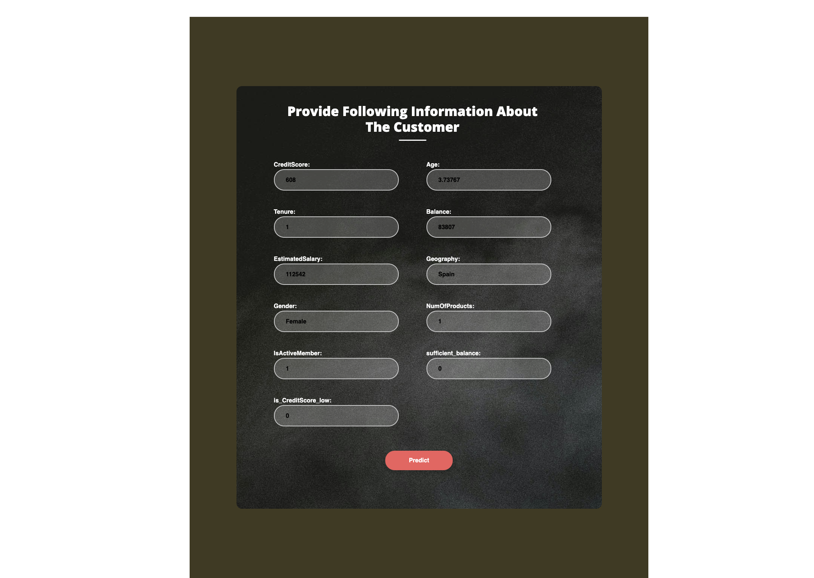

# Stop Customers from Walking Away: Predicting Bank Customer Churn 
# Webb App





# Project Overview: 

Bank customer churn prediction involves using data analysis and machine learning to forecast which customers may leave a bank. Understanding customer churn is crucial for businesses. Analyzing data helps identify patterns and indicators linked to customer attrition, allowing companies to develop targeted strategies to retain customers and predict churn. Predicting churn offers several benefits, including proactive customer management, improved satisfaction, and optimized operations. Accurate churn prediction enables banks to reduce churn rates, streamline operations, and achieve better financial performance.

## Benefits

-**Customer Retention**: Identifying customers at risk of churn enables banks to implement personalized retention strategies, such as offering tailored financial products, rewards, or incentives.

-**Risk Management**: Proactively managing customer churn helps mitigate revenue loss and minimize the impact on the bank's profitability.

-**Enhanced Customer Experience**: Anticipating and addressing customer needs and concerns before they churn can lead to improved satisfaction and loyalty.


## Project Aim

-**Predictive Modeling**: Building a model to predict which bank customers are likely to close their accounts or switch to another bank.

-**Pattern Discovery**: Identifying the most important factors influencing churn behavior.

Ultimately preventing customer churn and improving the bank's customer retention strategies.

## Example Use Cases
- Forecasting customer attrition for specific banking products, such as credit cards, loans, or investment accounts.
- Identifying high-value customers who are at risk of churn and prioritizing retention efforts accordingly.


# Workflow of the project


# Key Components

## 1. Data Ingestion, transformation and Selection 

-**Original data set**: Attached in the same repository: Customer-Churn-Records.csv
Raw Data was gethered from kaggle, following are the features in the original dataset: 
{RowNumber, CustomerId, Surname, CreditScore	Geography, Gender,Age, Tenure, Balance, NumOfProducts, HasCrCard, IsActiveMember, EstimatedSalary, Exited, Complain, Satisfaction Score, Card Type, Point Earned.} 

Extensive feature transformation and feature selection was performed on the original dataset "Customer-Churn-Records.csv". 

-**final data**: https://github.com/ravina029/datasets/raw/main/feature_engineered_bankchurn_data.csv.zip. 

This dataset contains detailed information about the customer: 
1. **Geography**: country of the customer 'France', 'Spain', or 'Germany'.
2. **Gender**: Male or Female 
3. **NumOfProducts**: Number of the product or services used by customer 1,2 or 3.
4. **IsActiveMember**: Whether the customer is active or not.
5. **sufficient_balance**: Does the customer hace sufficient balance, "yes" or "No".
6. **is_CreditScore_low**: it is Engineered feature have two values  "yes" or "No". 
7. **CreditScore**: Credit Score of the customer. 
8. **Age**: Age of the customer.
9. **Tenure**: time the customer has been associated with the bank.
10. **Balance**: Balance amount in the account of the customer.  
11. **EstimatedSalary**: Salary of the customer.
12. **Exited**: This column have two unique values 1 and 0, where 1 indicated customer churned and 0 not churned. A churned customer is one who has decided to discontinue their subscription or usage of the company's services. On the other hand, a non-churned customer is one who continues to remain engaged and retains their relationship with the company.

## 2. Exploratory Data Analysis
Univariate and bivariate Analysis was performed the on original dataset "Customer-Churn-Records.csv" documented in the file /Users/ravina/Desktop/CustomerChurnPrediction/research/EDA.ipynb. 

Interactive plots and graphs are used to drive the important patterns and conlcusion from the dataset. Insights from EDA hepled in the informed feature selection and feature elimination. Depending on the corelation matrix score "Complain" feature was drpped due to high correlation(100%) with the target value. Other features are selected using the Randomforestclassifier's feature importance score. 

## 3. Steps in Feature and Model Selection
Code file :"/Users/ravina/Desktop/CustomerChurnPrediction/research/Rough_model_Building.ipynb"

1. **Feature Engineering**: Extracting relevant features from the collected data, such as customer age, transaction activity, average balance, No of products, activity and complain. Two features "sufficient_balance" and "is_CreditScore_low" are engineered from the avalible data. which helped in outcome prediction.

2. **Data oversampling**: The target column "Exited" is highly imbalanced. Data oversampling technique 'SMOTE' is used to make the dataset balanced.

3. **Model Training**: Use several machine learning classification algorithms such as random Logistic Regression, Decision Tree, Ada Boost,Xgboost  and forest classifier to predict the likelihood of churn based on the extracted features.

4. **Feature Selection**: "Chi-square test" and Random forest Classifier is used to find the important features in precting the most important features in predicting the output.

5. **Evaluation**: Assessed the performance of these models using metrics like accuracy, precision, recall, and area under the ROC curve (AUC). RandomForestClassifier and xgboostClassifier performed the best. 

6. **Hyper Parameter Tuning**: Hyper Parameter tuning was performed using RandomizedSerchCv for Xgboost and GridSearchCv for Randomforest classifier. With Tuned hyperparameters Randomforest  captures more True positive rate over Xgboost. 

7. **Model Selection**: With careful observation of all the performance metrices of both the xgboost and randomforest classifier, randomforest is selected as the final model for prediction tasks due.
With RandomforestClassifier we attained an accuracy of 82.5% on the test data, with a precision score of 55.9% and a recall score of 70.3%. The ROC AUC score stands at 78%. However, there is room for enhancement, particularly in improving the precision score. 
- Our model's recall score of 70.3% means that the model correctly identified approximately 70.3% of all customers who actually churned. There is need to improve this score to retain the customers who are going to churn. 
-  Our precision score indicates that only 55% of positively predicted outcomes are accurate. This level of precision may result in misallocation of resources and benefits to customers who are mistakenly predicted to potentially churn, highlighting the need for improvement in our predictive model. 
- And ROC AUC score of 78% suggests that the model has good discriminatory power in predicting customer churn.
- F1 score of approximately 0.62  suggests that the model achieves a reasonably good trade-off between correctly identifying positive instances (precision) and capturing all positive instances (recall).
 8. **Model Version Control**: Utalized MLflow for model version control and convinient model optimization in end to end pipeline.

 9. **Web APP**: Created Flask Web App for easy user experince.

 10. **Model Deployement**: Utalized CI/CD pipelines, Docker containers and AWS EC2 instance for seamless model integration and deployement.


# Detailed End to End Implementation of the Project.

## Workflows
1. Update config.yaml
2. Update Schema.yaml
3. Update params.yaml
4. Update the entity
5. Update the configuration manager in src config
6. update the components
7. Update the pipeline
8. Update main.py
9. Update the app.py


## How to run?
### STEPS:

Clone the repository

```bash
https://github.com/ravina029/CustomerChurnPrediction
```
### STEP 01- Create a conda environment after opening the repository

```bash
conda create -n newvenv python=3.10 -y
```

```bash
conda activate newvenv
```


### STEP 02- install the requirements
```bash
pip install -r requirements.txt
```


```bash
# Finally run the following command
python app.py
```

Now,
```bash
open up you local host and port
```


## MLflow

[Documentation](https://mlflow.org/docs/latest/index.html)


##### cmd
- mlflow ui

### dagshub
[dagshub](https://dagshub.com/)

MLFLOW_TRACKING_URI=https://dagshub.com/ravina029/CustomerChurnPrediction.mlflow \
MLFLOW_TRACKING_USERNAME=ravina029 \
MLFLOW_TRACKING_PASSWORD=221d4e3a527ff8b9aef06e059d7efc4e89963e11 \
python script.py

Run this to export as env variables:

```bash

export MLFLOW_TRACKING_URI=https://dagshub.com/ravina029/CustomerChurnPrediction.mlflow 

export MLFLOW_TRACKING_USERNAME=ravina029

export MLFLOW_TRACKING_PASSWORD=221d4e3a527ff8b9aef06e059d7efc4e89963e11

```


# AWS-CICD-Deployment-with-Github-Actions

## 1. Login to AWS console.

## 2. Create IAM user for deployment

	#with specific access

	1. EC2 access : It is virtual machine

	2. ECR: Elastic Container registry to save your docker image in aws


	#Description: About the deployment

	1. Build docker image of the source code

	2. Push your docker image to ECR

	3. Launch Your EC2 

	4. Pull Your image from ECR in EC2

	5. Lauch your docker image in EC2

	#Policy:

	1. AmazonEC2ContainerRegistryFullAccess

	2. AmazonEC2FullAccess

	
## 3. Create ECR repo to store/save docker image
    - Save the URI: 161774582158.dkr.ecr.us-east-1.amazonaws.com/churnapp

	
## 4. Create EC2 machine (Ubuntu) 

## 5. Open EC2 and Install docker in EC2 Machine:
	
	
	#optinal

	sudo apt-get update -y

	sudo apt-get upgrade
	
	#required

	curl -fsSL https://get.docker.com -o get-docker.sh

	sudo sh get-docker.sh

	sudo usermod -aG docker ubuntu

	newgrp docker
	
# 6. Configure EC2 as self-hosted runner:
    setting>actions>runner>new self hosted runner> choose os> then run command one by one


# 7. Setup github secrets:

    AWS_ACCESS_KEY_ID=

    AWS_SECRET_ACCESS_KEY=

    AWS_REGION = eu-north-1

    AWS_ECR_LOGIN_URI = 161774582158.dkr.ecr.us-east-1.amazonaws.com/churnapp

    ECR_REPOSITORY_NAME = churnpredict


## About MLflow 
MLflow

 - Its Production Grade
 - Trace all of your expriements
 - Logging & tagging your model

 
# cloud Deployement url: 
https://18.233.62.142:5000/

# Link for Demo video of the WebApp: 
https://www.youtube.com/watch?v=UtYheQlZk_c

